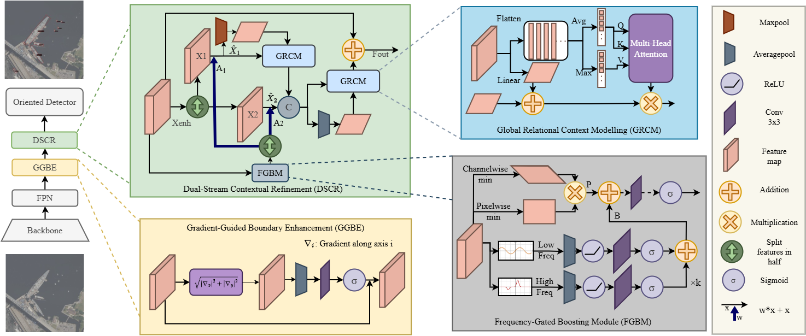

# GFCR-Net: Gradient-Guided and Frequency-Gated Context Refinement for Robust Ship Detection in Complex Optical Remote Sensing Images

Official PyTorch implementation of the IEEE Geoscience and Remote Sensing Letters (GRSL) paper:

**GFCR-Net: Gradient-Guided and Frequency-Gated Context Refinement for Robust Ship Detection in Complex Optical Remote Sensing Images**

**Tanish, Vidhan Jain, and Sobhan Kanti Dhara**

_IEEE Geoscience and Remote Sensing Letters (GRSL), 2026_

<p align="center">
  
  <br>
  <em>Figure 1. Overall architecture of GFCR-Net, highlighting the Gradient-Guided Boundary Enhancement (GGBE) and Dual-Stream Contextual Refinement (DSCR) modules.</em>
</p>

---

## Abstract

Robust ship detection in remote sensing imagery is essential for aerial surveillance, yet it remains challenging under adverse environmental conditions such as fog, haze, thin clouds, and sea clutter, as well as in dense and crowded port scenes. Existing methods often suffer from ambiguous receptive fields due to large variations in ship scales and complex surrounding contexts. This weakens target–background separability and results in frequent false alarms, missed detections, and inaccurate localization in complex maritime environments. To address these challenges, we propose the Gradient-Guided and Frequency-Gated Context Refinement Network (GFCR-Net), which strengthens backbone feature representations under difficult maritime conditions through carefully designed modules. First, the Gradient-Guided Boundary Enhancement (GGBE) module strengthens boundary-consistent activations while suppressing background interference using spatial gating on feature gradients. Second, the Dual-Stream Contextual Refinement (DSCR) module synergistically integrates the Frequency-Gated Boosting Module (FGBM) and Global Relational Context Modeling (GRCM) module. FGBM decomposes features into low-frequency components and high-frequency details to preserve ship contours while suppressing dominant background textures. Meanwhile, GRCM captures long-range contextual dependencies to better distinguish ships from nearby docks and ship-like clutter, especially in dense port scenes. Together, these components enable refined feature aggregation across both frequency and spatial dimensions. Extensive experiments on SCCOS, HRSC2016, and FGRSCS demonstrate consistent improvements over strong baselines while maintaining competitive parameter counts and FLOPs. Qualitative results further show fewer missed detections for small or partially visible ships under cluttered and low-visibility conditions.

---

## Results on SCCOS

| Method              | AP50      | Rec.      | F1        | AP75      | AP50:95   | APs       | APm       | APl       |
| ------------------- | --------- | --------- | --------- | --------- | --------- | --------- | --------- | --------- |
| RFR-CNN             | 0.673     | 0.767     | 0.717     | 0.374     | 0.352     | 0.379     | 0.775     | 0.889     |
| R3Det               | 0.690     | 0.764     | 0.725     | 0.404     | 0.365     | 0.352     | 0.798     | 0.905     |
| GWD                 | 0.637     | 0.773     | 0.698     | 0.419     | 0.352     | 0.330     | 0.831     | 0.885     |
| OR-CNN              | 0.766     | 0.839     | 0.801     | 0.608     | 0.462     | 0.526     | 0.893     | 0.909     |
| S2A-Net             | 0.760     | 0.831     | 0.794     | 0.501     | 0.426     | 0.430     | 0.893     | 0.908     |
| KFIoU               | 0.630     | 0.771     | 0.693     | 0.347     | 0.332     | 0.329     | 0.759     | 0.887     |
| OrRepPoints         | 0.693     | 0.761     | 0.725     | 0.151     | 0.281     | 0.108     | 0.490     | 0.730     |
| ACM                 | 0.761     | 0.846     | 0.801     | 0.612     | 0.460     | 0.370     | 0.824     | 0.908     |
| AMMBA               | 0.772     | 0.862     | 0.814     | 0.593     | 0.436     | 0.458     | 0.889     | 0.908     |
| NIRNet              | 0.767     | 0.811     | 0.788     | 0.611     | 0.461     | 0.527     | 0.898     | 0.908     |
| ReDiffDet           | 0.753     | 0.831     | 0.790     | 0.609     | 0.456     | 0.538     | 0.897     | 0.909     |
| **GFCR-Net (ours)** | **0.790** | **0.892** | **0.838** | **0.611** | **0.538** | **0.543** | **0.899** | **0.909** |

---

## Environment Setup (Anaconda)

### 1. Create and activate a conda environment

```bash
conda create -n gfcrnet python=3.11 -y
conda activate gfcrnet
```

### 2. Install PyTorch (CUDA 11.8)

```bash
pip install torch==2.0.1 torchvision==0.15.2 torchaudio==2.0.2 --index-url https://download.pytorch.org/whl/cu118
```

### 3. Install MMDetection and OpenMIM

```bash
pip install mmdet==2.28.2
pip install -U openmim
mim install "mmengine>=0.7.0"
```

### 4. Install MMCV

```bash
mim install "mmcv==2.0.1"
```

### 5. Clone and install MMRotate

```bash
git clone https://github.com/<your-username>/gfcr-net.git
cd gfcr-net
pip install -r requirements/build.txt
pip install -v -e .
```

### 6. Additional dependencies

```bash
pip install torch-dct
pip install xmltodict
pip install numpy==1.26.4
```

### 7. Verify installation

On Windows (Command Prompt or PowerShell):

```bash
python -m pip list | findstr /I "torch mmcv mmdet mmengine mmrotate torch-dct numpy"
```

On Linux or macOS:

```bash
python -m pip list | grep -E 'torch|mmcv|mmdet|mmengine|mmrotate|torch-dct|numpy'
```

---

## File Structure

```
gfcr-net/
├── configs/
│   ├── _base_/
│   └── gfcrnet/
│       └── gfcrnet_r50_fpn_1x_sccos.py
├── mmrotate/
│   └── models/
│       └── necks/
│           ├── gfcr_net.py
│           └── __init__.py
├── tools/
│   ├── train.py
│   ├── test.py
│   └── analysis_tools/
│       └── get_flops.py
├── demo/
│   └── image_demo.py
├── data/
│   └── sccos_dota/
├── checkpoints/
├── work_dirs/
├── requirements/
├── requirements.txt
└── README.md
```

---

## Pretrained Checkpoints

| Model            | Dataset | Config                                                                       | Checkpoint                                                                                                |
| ---------------- | ------- | ---------------------------------------------------------------------------- | --------------------------------------------------------------------------------------------------------- |
| GFCR-Net R50 FPN | SCCOS   | [`gfcrnet_r50_fpn_1x_sccos.py`](configs/gfcrnet/gfcrnet_r50_fpn_1x_sccos.py) | [Download checkpoint](https://drive.google.com/file/d/1LDbCax6pcW8pbh4B7gSbA4URZJdYLoAE/view?usp=sharing) |

Download the checkpoint to `checkpoints/gfcrnet_r50_fpn_1x_sccos.pth` and use it for testing or inference.

## Training

You can use the provided checkpoint or train GFCR-Net on your own dataset. Before training, update the configuration file with your dataset settings, including `data_root`, training, validation, and test image and annotation paths, dataset classes, and any dataset-specific parameters.

```bash
cd gfcr-net

mkdir -p work_dirs/GFCRNet_train

python tools/train.py \
    configs/gfcrnet/gfcrnet_r50_fpn_1x_sccos.py \
    --work-dir work_dirs/GFCRNet_train \
    --gpus 1
```

The trained checkpoints are saved in `work_dirs/GFCRNet_train`.

---

## Testing

Use either the downloaded checkpoint or a checkpoint generated during training:

```bash
mkdir -p work_dirs/GFCRNet_test

# Downloaded checkpoint
CHECKPOINT=checkpoints/gfcrnet_r50_fpn_1x_sccos.pth

# Or a checkpoint from training
# CHECKPOINT=work_dirs/GFCRNet_train/latest.pth

python tools/test.py \
    configs/gfcrnet/gfcrnet_r50_fpn_1x_sccos.py \
    $CHECKPOINT \
    --out work_dirs/GFCRNet_test/results.pkl \
    --show-dir work_dirs/GFCRNet_test/vis
```

---

## Inference

Set `CHECKPOINT` to the downloaded checkpoint or to a checkpoint from `work_dirs/GFCRNet_train`.

```bash
CHECKPOINT=checkpoints/gfcrnet_r50_fpn_1x_sccos.pth
# CHECKPOINT=work_dirs/GFCRNet_train/latest.pth

python demo/image_demo.py \
    <path/to/image_or_folder> \
    configs/gfcrnet/gfcrnet_r50_fpn_1x_sccos.py \
    $CHECKPOINT \
    --out-file <path/to/output.jpg>
```

```python
from mmrotate.apis import init_detector, inference_detector

config_file = 'configs/gfcrnet/gfcrnet_r50_fpn_1x_sccos.py'
checkpoint_file = 'checkpoints/gfcrnet_r50_fpn_1x_sccos.pth'
# checkpoint_file = 'work_dirs/GFCRNet_train/latest.pth'

model = init_detector(config_file, checkpoint_file, device='cuda:0')
result = inference_detector(model, 'demo/demo.jpg')
model.show_result('demo/demo.jpg', result, out_file='result.jpg')
```
